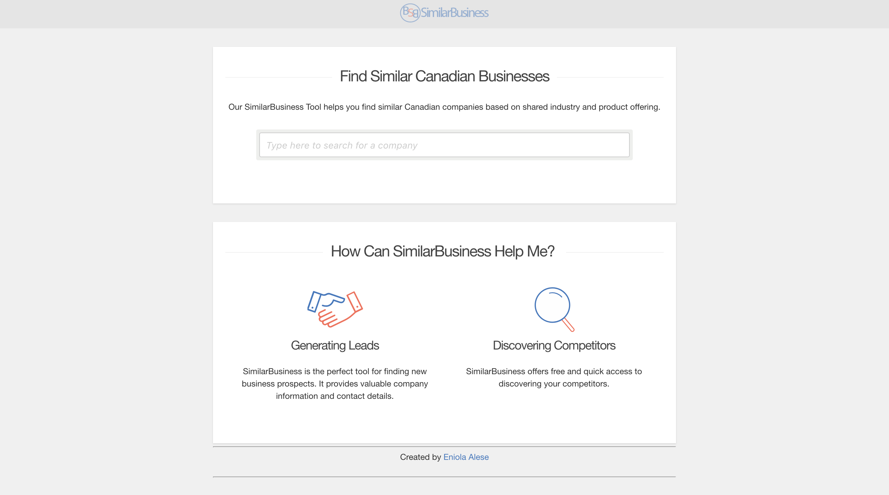

# SimilarBusiness
SimilarBusiness is an app created to help businesses find similar companies based on shared industry and product offering. It uses documents embeddings to perform a similarity search and make recommendations. Deployed using Heroku.

Requirements
---
Install the requirements using `pip install -r requirements.txt`

Demo
---

